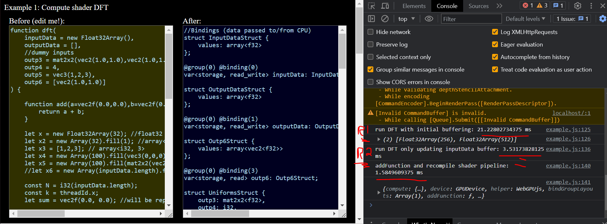
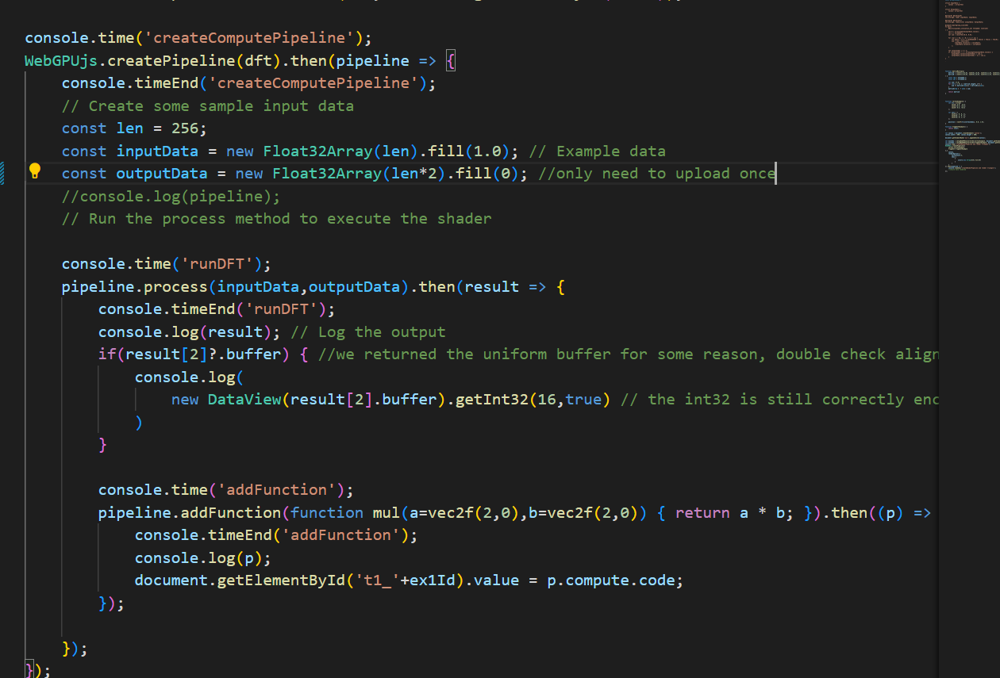
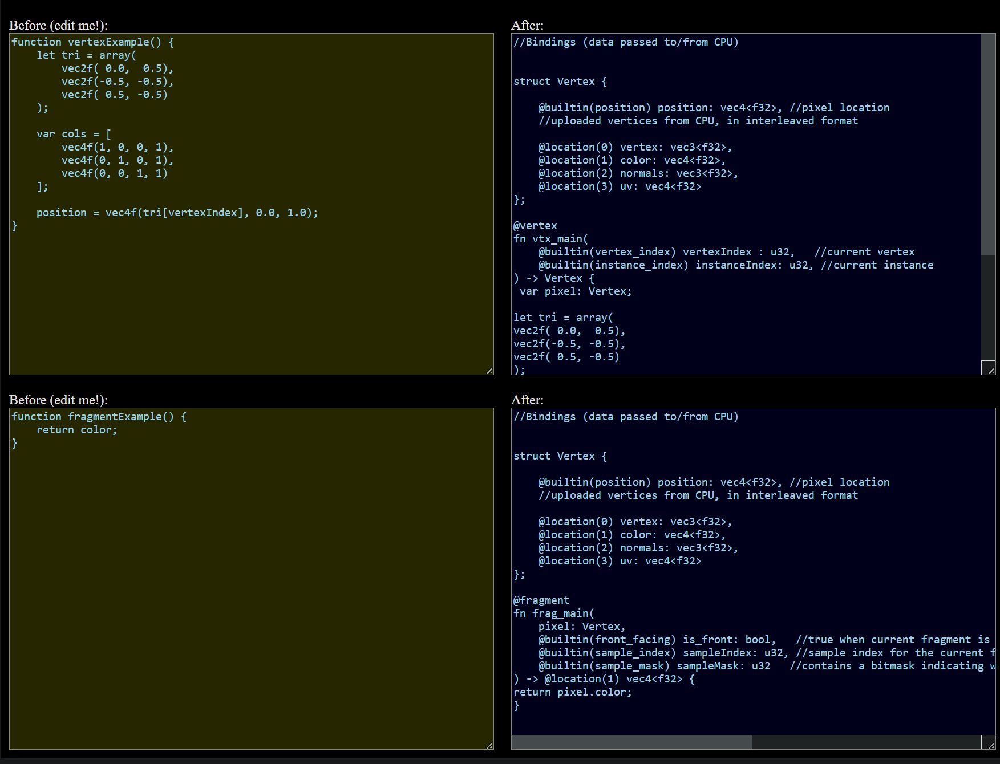

## WebGPUjs

Write full featured WGSL pipelines in plain javascript.

**Work in Progress**

The compute shaders work great but rendering is currently broken so docs and examples are forthcoming, but check this out!

Write full featured WebGPU compute and rendering shaders with implicit javascript! ... Inspired by GPUjs

What's cooking? This wall of text will be replaced with docs...

This library lets you write functions that look *nearly* like real javascript and transpile them to full functioning WebGPU shader pipelines. I say nearly because you can fake the gpu math overloads and types without tripping javascript's compiler errors as long as the function doesn't execute. It takes ~1ms on average to parse the javascript into the desired shader target, and <100ms to set up the WebGPU pipeline the first time. After that, gpu calls execute blazingly fast and reuse buffers efficiently.

Write default inputs on your javascript function to dynamically define input array buffers and uniform buffers that you can pass asynchronously to run draw or compute calls. Receive compute call outputs by simply returning the variables you want to come back in the staging buffers. In seconds you can be using state of the art web GPU compute!

In 3 barebones javascript function definitions you can have a full cycling compute and render pipeline, with efficient automation of data structures and so on. It's fast too! After that, repeated calls follow general best memory practices while you can can update specific inputs as needed. This lets you have some real fun with WebGPU without as much of the headache of tuning your pipeline. 

It doesn't do everything WebGPU can do (yet), but it's damn near the easiest way to process multiple buffers through the GPU in a single call that we've tried, and WebGPU offers more affordances for dynamic programming.

Combined shaders will have implicit access to each other's input buffers based on variable names. You can theoretically chain as many shaders as you want this way, where sequentially combined shaders will gain all of the input bindings of the previous to run as many complex functions as you want with varying input usage. WebGPU is much more dynamic so it's a lot easier to deal with dynamic array sizes and mix and match what you want out of your compute shaders.

### Contribute!

Please help us generalize these systems better, WebGPU has a lot more nuance we haven't tapped yet and more test cases we can build transpilation abilities for. The point is to make it fun, but there don't seem to be any performance issues either so it could be of real use.
