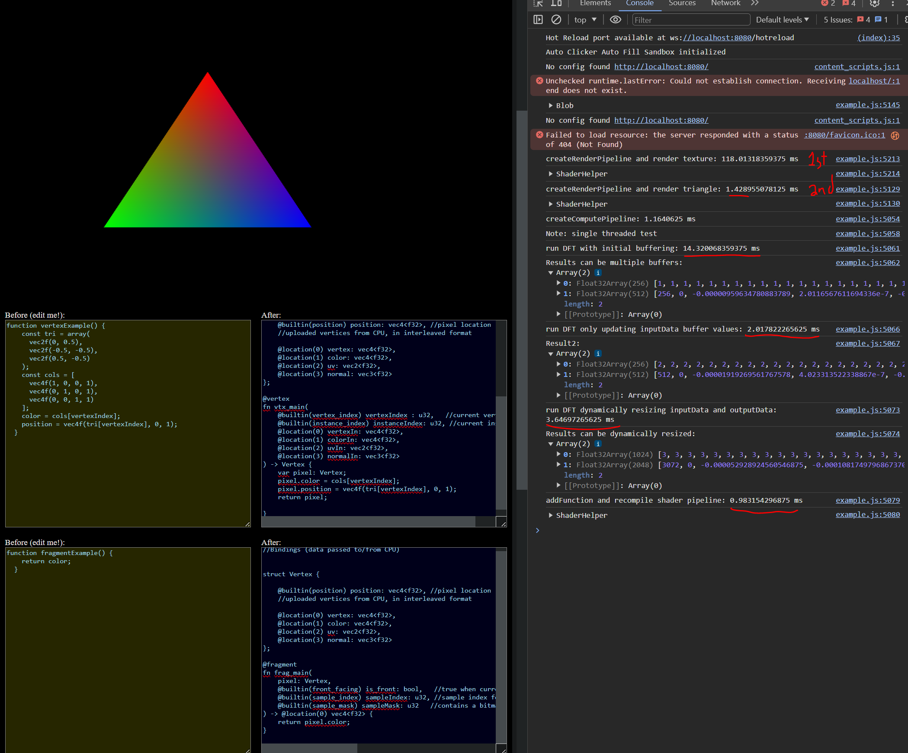
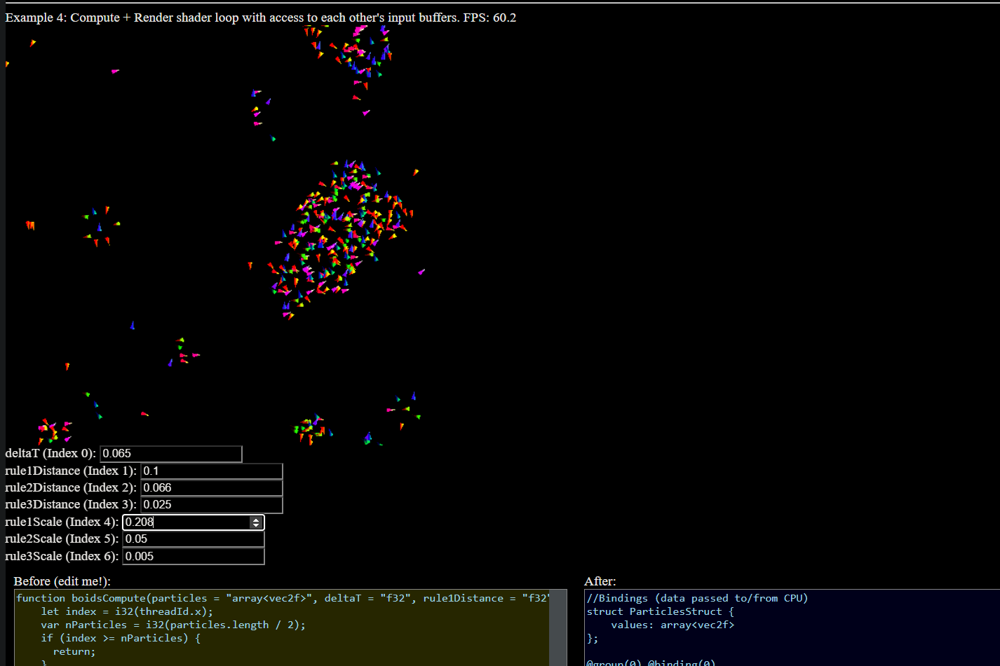

## WebGPUjs

Write full featured WGSL pipelines in plain(ish) javascript.

SupportS:
- Write functional compute shaders etc. and output one or multiple resulting buffers. 
- Compile compute, vertex, Fragment shaders and any chain together combinations thereof.
- Render to canvases.
- Array buffers, uniforms, VBOs, Index Buffers, Textures (incl storage texture specification).
- Specify instance vbos (see boids example)
- boilerplate access to builtins or for doing read/writes to vertex buffer objects across vertex/fragment 
- The transpiler will attempt to combine bindings when using shared naming conventions for easy shared buffer allocation across multiple shader programs.
- Lots more but we are testing things out still and trying to bring it up to something extremely common sense before we fully document the API. 
 
**Work in Progress**

To run the example: `npm i -g tinybuild` then `npm run example`

### Looking 4 contributors 

It's fun I guess
