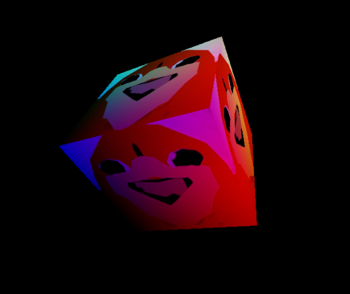

## WebGPUjs

Write full featured WGSL pipelines in plain javascript.

We are using some boilerplate conventions but things like vertex buffer allocation or type inferencing for textures etc and so on could be a lot better. Nothing is documented yet until we're happy with it so just try to play with the examples if you are feeling motivated. 

**Work in Progress**

To run the example: `npm i -g tinybuild` then `npm run example`


Webgpujs is trying to capture webgpu's API in a procedural pipeline framework. It lets you specify the shaders to the degree of specificity you need without all of the boilerplate of a straight implementation of the API. 

On top of this we have a work in progress transpiler that uses speedy regex calls to compile a faux-javascript function into a full fledged and fairly optimal shader of a desired target (computer, vertex, or fragment). It can infer bindings and so on out of the transpiler (or you can provide your own shaders and bindings, render pass descriptors, etc). 

WebGPU does not have a wide variety of data structures and functions so it's not that difficult to get it into a procedural framework like this without diminishing the enhanced flexibility of WebGPU over WebGL. I am just exploring ease of use for compute and rendering tasks. 

## Compute Shader example: Discrete Fourier Transform (DFT)

Say I want to implement this compute shader for a discrete fourier transform which is an n^2 scaling problem without optimizations like nyquist limits and divide-and-conquer. This means it will take several seconds to execute a moderately sized sample set on a linear 

```wgsl

      
struct InputData {
    values : array<f32>
}

struct OutputData {
    values: array<f32>
}

@group(0) @binding(0)
var<storage, read> inputData: InputData;

@group(0) @binding(1)
var<storage, read_write> outputData: OutputData;

@compute @workgroup_size(256)
fn main(
    @builtin(global_invocation_id) threadId: vec3<u32>
) {
    let N = arrayLength(&inputData.values);
    let k = threadId.x;
    var sum = vec2<f32>(0.0, 0.0);

    for (var n = 0u; n < N; n = n + 1u) {
        let phase = 2.0 * 3.14159265359 * f32(k) * f32(n) / f32(N);
        sum = sum + vec2<f32>(
            inputData.values[n] * cos(phase),
            -inputData.values[n] * sin(phase)
        );
    }

    let outputIndex = k * 2;
    if (outputIndex + 1 < arrayLength(&outputData.values)) {
        outputData.values[outputIndex] = sum.x;
        outputData.values[outputIndex + 1] = sum.y;
    }
}

```

We can implement this as:

```js

import { WebGPUjs } from "../src/pipeline";
//import { WGSLTranspiler } from "../src/transpiler";

//dft is an O(n^2) example, plus a bunch of other nonsense just to test the transpiler out, we'll do this proper soon
function dft(
    inputData = [], 
    outputData = [], 
) {

    let sum = vec2f(0.0, 0.0);

    for (let n = 0; n < N; n++) {
        const phase = 2.0 * Math.PI * f32(k) * f32(n) / f32(N);
        sum = sum + vec2f(
            inputData[n] * Math.cos(phase),
            -inputData[n] * Math.sin(phase)
        );
    }

    //you should always add semicolons to be in-spec with compute shaders but we will try to add them for you

    const outputIndex = k * 2 //use strict
    if (outputIndex + 1 < outputData.length) {
        outputData[outputIndex] = sum.x;
        outputData[outputIndex + 1] = sum.y;
    }

    
    return [inputData, outputData]; //Returning an inputs lets us allocate several storage buffers implicitly. If you return uniforms 
    //return outputData;
    //return outp4; //we can also return the uniform buffer though it is immutable so it's pointless
}


```

Right now input types are interpreted through default values which can be implicit like using arrays or typed arrays, or numbers or fake `vec2f()` or `mat2x2()` etc calls, or you can just use strings like `mat2x2<f32>` or `array<vec2f>` and so on for more explicit control. We'd like to make this specifiable with options too when you set up the pipeline so it's not dependent on defaults since that's a bit jank. All non-array buffer values will be lumped into a uniform buffer.

Outputs are specified by return statements, which are not native to wgsl but we just use it to imply what to use for output storage buffers. You can return the uniform buffer too by returning any uniform values.

And we can compile and run this instantly with:

```js

WebGPUjs.createPipeline(dft).then(pipeline => {
      // Create some sample input data
      const len = 256;
      const inputData = new Float32Array(len).fill(1.0); // Example data
      const outputData = new Float32Array(len*2).fill(0); //only need to upload once if len is the same, dfts return real and imag for single vectors (unless we convert gpu-side)   
      pipeline.process(inputData, outputData).then(result => {
         console.log('Results can be multiple buffers:',result); // Log the output
      });

});

```

Since the output buffer is just there to be filled we don't need to specify it the second time:

```js

const inputData2 = new Float32Array(len).fill(2.0); // Example data, same length so outputData can be the same

pipeline.process(inputData2).then((r2) => {
   console.log('Result 2:',r2); // Log the output
});

```

And we can dynamically resize the buffers at any time:
```js


const len2 = 1024;
const inputData3 = new Float32Array(len2).fill(3.0); // Example data
const outputData3 = new Float32Array(len2*2).fill(0); //only need to upload once if len is the same, dfts return real and imag for single vectors (unless we convert gpu-side)

pipeline.process(inputData3, outputData3).then((r3) => {
   console.log('Results can be dynamically resized:', r3); // Log the output
});

```


## Rendering 

This is the most underdeveloped but right now you can chain compute, vertex, and fragment shaders together to do rendering. When it's finished we should have no trouble replicating any samples, but there is more flexibility to add to the system.

#### Triangle

```js

function vertexExample() {
    const tri = array(
        vec2f( 0.0,  0.5),  
        vec2f(-0.5, -0.5),  
        vec2f( 0.5, -0.5)   
    );

    const cols = [
        vec4f(1, 0, 0, 1), 
        vec4f(0, 1, 0, 1), 
        vec4f(0, 0, 1, 1) 
    ];
    color = cols[vertexIndex];
    position = vec4f(tri[vertexIndex], 0.0, 1.0);
}

function fragmentExample() {
    return color;
}

let canvas = document.createElement('canvas');
canvas.width = 800; canvas.height = 600;

document.getElementById('ex2').appendChild(canvas);

let ex12Id1 = setupWebGPUConverterUI(vertexExample, document.getElementById('ex2'), 'vertex');
let ex12Id2 = setupWebGPUConverterUI(fragmentExample, document.getElementById('ex2'), 'fragment',ex12Id1.lastBinding);

setTimeout(() => {
    console.time('createRenderPipeline and render triangle');

    WebGPUjs.createPipeline({
        vertex:vertexExample,
        fragment:fragmentExample
    },{
        canvas,
        renderPass:{
            vertexCount:3,
            // vbos:[ //upload vbos, we'll also just fill a dummy vbo for you if none are provided
            //     { // pos vec4, color vec4, uv vec2, normal vec3
            //         //vertex
            //         color:new Array(3*4).fill(0)
            //         //uv
            //         //normal
            //     }
            // ],
        }
    }).then(pipeline => {
        console.timeEnd('createRenderPipeline and render triangle');
        console.log(pipeline);
        //should have rendered
    });
    
},500)

```
 
Note our transpiler will move the consts out and a few other things to optimize the code a bit.

#### Textured cube


```js


const cubeVertices = new Float32Array([
    // float4 vertex, float4 color, float2 uv, float3 normal
  1, -1, 1, 1,   1, 0, 1, 1,  0, 1, 0,0,0,
  -1, -1, 1, 1,  0, 0, 1, 1,  1, 1, 0,0,0,
  -1, -1, -1, 1, 0, 0, 0, 1,  1, 0, 0,0,0,
  1, -1, -1, 1,  1, 0, 0, 1,  0, 0, 0,0,0,
  1, -1, 1, 1,   1, 0, 1, 1,  0, 1, 0,0,0,
  -1, -1, -1, 1, 0, 0, 0, 1,  1, 0, 0,0,0,

  1, 1, 1, 1,    1, 1, 1, 1,  0, 1, 0,0,0,
  1, -1, 1, 1,   1, 0, 1, 1,  1, 1, 0,0,0,
  1, -1, -1, 1,  1, 0, 0, 1,  1, 0, 0,0,0,
  1, 1, -1, 1,   1, 1, 0, 1,  0, 0, 0,0,0,
  1, 1, 1, 1,    1, 1, 1, 1,  0, 1, 0,0,0,
  1, -1, -1, 1,  1, 0, 0, 1,  1, 0, 0,0,0,

  -1, 1, 1, 1,   0, 1, 1, 1,  0, 1, 0,0,0,
  1, 1, 1, 1,    1, 1, 1, 1,  1, 1, 0,0,0,
  1, 1, -1, 1,   1, 1, 0, 1,  1, 0, 0,0,0,
  -1, 1, -1, 1,  0, 1, 0, 1,  0, 0, 0,0,0,
  -1, 1, 1, 1,   0, 1, 1, 1,  0, 1, 0,0,0,
  1, 1, -1, 1,   1, 1, 0, 1,  1, 0, 0,0,0,

  -1, -1, 1, 1,  0, 0, 1, 1,  0, 1, 0,0,0,
  -1, 1, 1, 1,   0, 1, 1, 1,  1, 1, 0,0,0,
  -1, 1, -1, 1,  0, 1, 0, 1,  1, 0, 0,0,0,
  -1, -1, -1, 1, 0, 0, 0, 1,  0, 0, 0,0,0,
  -1, -1, 1, 1,  0, 0, 1, 1,  0, 1, 0,0,0,
  -1, 1, -1, 1,  0, 1, 0, 1,  1, 0, 0,0,0,

  1, 1, 1, 1,    1, 1, 1, 1,  0, 1, 0,0,0,
  -1, 1, 1, 1,   0, 1, 1, 1,  1, 1, 0,0,0,
  -1, -1, 1, 1,  0, 0, 1, 1,  1, 0, 0,0,0,
  -1, -1, 1, 1,  0, 0, 1, 1,  1, 0, 0,0,0,
  1, -1, 1, 1,   1, 0, 1, 1,  0, 0, 0,0,0,
  1, 1, 1, 1,    1, 1, 1, 1,  0, 1, 0,0,0,

  1, -1, -1, 1,  1, 0, 0, 1,  0, 1, 0,0,0,
  -1, -1, -1, 1, 0, 0, 0, 1,  1, 1, 0,0,0,
  -1, 1, -1, 1,  0, 1, 0, 1,  1, 0, 0,0,0,
  1, 1, -1, 1,   1, 1, 0, 1,  0, 0, 0,0,0,
  1, -1, -1, 1,  1, 0, 0, 1,  0, 1, 0,0,0,
  -1, 1, -1, 1,  0, 1, 0, 1,  1, 0, 0,0,0
]);

const cubeIndices = new Uint16Array([
  0, 1, 2, 3, 4, 5,       // Bottom face
  6, 7, 8, 9, 10, 11,     // Right face
  12, 13, 14, 15, 16, 17, // Top face
  18, 19, 20, 21, 22, 23, // Left face
  24, 25, 26, 27, 28, 29, // Front face
  30, 31, 32, 33, 34, 35  // Back face
]);

//texture https://webgpu.github.io/webgpu-samples/samples/texturedCube
function cubeExampleVert( 
    modelViewProjectionMatrix='mat4x4<f32>'
) {
    position = modelViewProjectionMatrix * vertexIn; //alternatively we could use a builtInUniform to transform the projection matrix with the timestamp increment
    uv = uvIn;
    vertex = 0.5 * (vertexIn + vec4f(1,1,1,1));
    color = colorIn;
}

function cubeExampleFrag() {
    return textureSample(image, imgSampler, uv) * color;
}

const createImageExample = async () => {
    const response = await fetch('./knucks.jpg');
    let data = await response.blob();
    console.log(data);
    const imageBitmap = await createImageBitmap(data);
    
    
    const textureData = {
        source:imageBitmap,
        texture:{}, //overrides to texture settings 
        layout:{flipY:true}
    }

    let canv2 = document.createElement('canvas'); 
    canv2.width = 800; canv2.height = 600;
    document.getElementById('ex3').appendChild(canv2);
    let ex3Id1 = setupWebGPUConverterUI(cubeExampleVert, document.getElementById('ex3'), 'vertex');
    let ex3Id2 = setupWebGPUConverterUI(cubeExampleFrag, document.getElementById('ex3'), 'fragment', ex3Id1.webGPUCode.lastBinding);
    

    const aspect = canv2.width / canv2.height;
    const projectionMatrix = m4.perspective(
        (2 * Math.PI) / 5,
        aspect,
        1,
        100.0
    );
    const modelViewProjectionMatrix = m4.create();

    function getTransformationMatrix() {
        const viewMatrix = m4.identity();
        m4.translate(viewMatrix, v3.fromValues(0, 0, -4), viewMatrix);
        const now = Date.now() / 1000;
        m4.rotate(
            viewMatrix,
            v3.fromValues(Math.sin(now), Math.cos(now), 0),
            1,
            viewMatrix
        );
        m4.multiply(projectionMatrix, viewMatrix, modelViewProjectionMatrix);
        return modelViewProjectionMatrix;
    } 
    let transformationMatrix = getTransformationMatrix();
    console.time('createRenderPipeline and render texture');
    WebGPUjs.createPipeline({
        vertex:cubeExampleVert,
        fragment:cubeExampleFrag
    },{
        canvas:canv2,
        renderPass:{ //tell it to make an initial render pass with these inputs
            vertexCount:cubeVertices.length/13,
            vbos:[ //we can upload vbos
                cubeVertices //the shader system will set the draw call count based on the number of rows (assumed to be position4,color4,uv2,normal3 or vertexCount = len/13) in the vertices of the first supplied vbo
            ],
            textures:{
                image:textureData //corresponds to the variable which is defined implicitly by usage with texture calls
            },
            indexBuffer:cubeIndices,
            indexFormat:'uint16'
        },
        // bindings:{ //binding overrides (assigned to our custom-generated layout)
        //     image:{
        //         texture:{viewDimension:'2d', sampleType:'float'} 
        //     }
        // },
        //overrides for pipeline descriptor will be assigned so you can add or rewrite what you need over the defaults
        renderPipelineDescriptor:{ primitive: {topology:'triangle-list', cullMode:'back'}},
        //additional render or compute pass inputs (just the UBO update in this case)
        inputs:[transformationMatrix] //placeholder mat4 projection matrix (copy wgsl-matrix library example from webgpu samples)
    }).then(pipeline => {
        console.timeEnd('createRenderPipeline and render texture');
        console.log(pipeline);
        //should have rendered

        let now = performance.now();
        let fps = [];
        let fpsticker = document.getElementById('ex3fps');
        let anim = () => {
            let time = performance.now();
            let f = 1000/(time-now);
            fps.push(f);
            let frameTimeAvg = fps.reduce((a,b) => a+b)/(fps.length);
            //console.log(frameTimeAvg.toFixed(1));
            fpsticker.innerText = frameTimeAvg.toFixed(1);
            if(fps.length > 10) fps.shift();
            now = time;
            
            //update projection matrix then re-render
            transformationMatrix = getTransformationMatrix(); 
            pipeline.render({
                vertexCount:cubeVertices.length/13 // pos vec4, color vec4, uv vec2, normal vec3
            }, transformationMatrix);
            requestAnimationFrame(anim);
        }
        anim();
    });

}
createImageExample();

```




## Customizing the pipeline manually

See [`./src/types.ts`](./src/types.ts) for input options, this is all rough cut as we need to make things like vertex buffers and variable typing more explicit to open up more options for rendering.

You can do everything to pass all of your own shader text and pipeline settings etc to the shader helper, without touching our transpiler, the point will be to make it easier to hybridize code and otherwise not handicap ourselves with this little framework. It all needs to be documented and expanded on as things solidify. There is plenty missing especially for rendering.


The `WebGPU.createPipeline()` call is like this:

```ts

createPipeline = async (
        shaders: Function | {
                code:Function|string, 
                transpileString?:boolean //functions are auto-transpiled
            } | {
                compute:string|Function,
                vertex:string|Function,
                fragment:string|Function,
                transpileString?:boolean
            },
        options:ShaderOptions & ComputeOptions & RenderOptions = {}
):Promise<ShaderHelper>

```

The options are as follows, see the types.ts file for the rest:

```ts
type ShaderOptions = {
    device?:GPUDevice
    prependCode?:string, //prepend any code to your shaders e.g. custom bindings
    bindGroupNumber?:number,
    getPrevShaderBindGroups?:string,
    functions?:Function[], //can transpile functions into utilities
    variableTypes?:{[key:string]:string|{binding:string}}, //we can skip the implicit typing of the bindings and set them ourselves e.g. tex1:'texture_2d' or tex1:{binding:'@group(0) @binding(1) var x: texture_2d;'} etc.
    inputs?:any[],
    bindGroupLayouts?:GPUBindGroupLayout[],
    bindGroups?:GPUBindGroup[],
    bindings?:{[key:string]:Partial<GPUBindGroupEntry>}
    lastBinding?:number, 
    bufferGroups?:any,
    skipCombinedBindings?:boolean //don't scan for shared bindings in grouped shaders with common variable names
}

type ComputeOptions = {
    workGroupSize?:number,
    computePipelineSettings?:GPUComputePipelineDescriptor,
    computePass?:ComputePassSettings
};

type RenderOptions = {
    canvas?:HTMLCanvasElement|OffscreenCanvas,
    context?:GPUCanvasContext,
    contextSettings?:GPUCanvasConfiguration,
    renderPipelineDescriptor?:Partial<GPURenderPipelineDescriptor>, //specify partial settings e.g. the primitive topology
    renderPassDescriptor?:GPURenderPassDescriptor,
    renderPipelineSettings?:any,
    nVertexBuffers?:number, //set to allow multiple vbos 
    renderPass?:RenderPassSettings
};


```


The rest is a work in progress, you can see how we're trying different things with this random code that all transpiles correctly:

```js

//dft is an O(n^2) example, plus a bunch of other nonsense just to test the transpiler out, we'll do this proper soon
function dft(
    inputData = new Float32Array(), 
    outputData = [], 
    //dummy inputs
    outp3 = mat2x2(vec2(1.0,1.0),vec2(1.0,1.0)), //approximate data structure wrappers will infer float or int from decimal usage
    outp4 = "i32",
    outp5 = vec3(1,2,3),
    outp6 = [vec2(1.0,1.0)]
) {

    function add(a=vec2f(0.0,0.0),b=vec2f(0.0,0.0)) { //transpiled out of main body
        return a + b;
    }

    let x = new Float32Array(32); //float32 array<f32, 32> (default)
    let x2 = new Array(32).fill(inputData[0]); //array<i32, 32> array (no decimal)
    const x3 = [1,2,3]; // array<i32, 3>
    let x4 = new Array(100).fill(vec3(0,0,0)) //array<vec3<i32>, 100>
    let x5 = new Array(100).fill(mat2x2(vec2(1,1),vec2(1,1)));
    //let x6 = new Array(inputData.length).fill(0.0) //cannot dynamically size const arrays

    const N = i32(inputData.length);
    const k = threadId.x;
    let sum = vec2f(0.0, 0.0); //will be replaced with var

    var sum2 = add(sum,sum);

    let width = resX;

    const b = 3 + outp4;

    `const bb : array<f32, 5> = array(1,2,3,4,5)`; //write-in

    var M = mat4x4(
        vec4f(1.0,0.0,0.0,0.0),
        vec4f(0.0,1.0,0.0,0.0),
        vec4f(0.0,0.0,1.0,0.0),
        vec4f(0.0,0.0,0.0,1.0)
    ); //identity matrix

    let D = M + M;

    var Z = outp3 * mat2x2(vec2f(4.0,-1.0),vec2f(3.0,2.0));

    var Zz = outp5 + vec3(4,5,6);

    for (let n = 0; n < N; n++) {
        const phase = 2.0 * Math.PI * f32(k) * f32(n) / f32(N);
        sum = sum + vec2f(
            inputData[n] * Math.cos(phase),
            -inputData[n] * Math.sin(phase)
        );
    }

    //you should always add semicolons to be in-spec with compute shaders but we will try to add them for you

    const outputIndex = k * 2 //use strict
    if (outputIndex + 1 < outputData.length) {
        outputData[outputIndex] = sum.x;
        outputData[outputIndex + 1] = sum.y;
    }

    
    return [inputData, outputData]; //returning an array of inputs lets us return several buffer promises
    //return outputData;
    //return outp4; //we can also return the uniform buffer though it is immutable so it's pointless
}

```

Several things to notice are array allocations all will be transpiled implicitly based on obvious patterns. Math calls will be replaced or filled implicitly. Array.fill calls will be transpiled. Also you can just flat out write a multi line template string in and it will assume it is plain shader code. That can be nice for adding more complex utility functions and structs than our transpiler recognizes. Right now the default values don't mean anything just the types, which we'll figure out.

Which transpiles to

```wgsl

//Bindings (data passed to/from CPU) 
struct InputDataStruct {
    values: array<f32>
};

@group(0) @binding(0)
var<storage, read_write> inputData: InputDataStruct;

struct OutputDataStruct {
    values: array<f32>
};

@group(0) @binding(1)
var<storage, read_write> outputData: OutputDataStruct;

struct Outp6Struct {
    values: array<vec2<i32>>
};

@group(0) @binding(3)
var<storage, read> outp6: Outp6Struct;

struct DefaultUniforms {
    resX: f32,
};

@group(0) @binding(4) var<uniform> defaults: DefaultUniforms;

struct UniformsStruct {
    outp3: mat2x2<f32>,
    outp4: i32,
    outp5: vec3<i32>,
};

@group(0) @binding(2) var<uniform> uniforms: UniformsStruct;


const x3 : array<i32, 3> = array<i32, 3>(
    1, 2, 3
);
const bb : array<f32, 5> = array(1,2,3,4,5);

fn mul(a : vec2f, b : vec2f) -> vec2f {
    return a * b;
}

fn add(a : vec2f, b2 : vec2f) -> vec2f {
    return a + b2;
}


//Main function call
//threadId tells us what x,y,z thread we are on

@compute @workgroup_size(256)
fn compute_main(  
    @builtin(global_invocation_id) threadId: vec3<u32>, //shader grid position
    @builtin(local_invocation_id) localId: vec3<u32>,   //workgroup grid position
    @builtin(local_invocation_index) localIndex: u32,   //linear index within workgroup grid
    @builtin(num_workgroups) workgroups: vec3<u32>,     //dispatch size (x,y,z) group count
    @builtin(workgroup_id) workgroupId: vec3<u32>       //position of workgroup in compute shader grid
) {
    var x : array<f32, 32>;
    var x2 : array<f32, 32>;
    for (var i: i32 = 0; i < 32; i = i + 1) {
        	x2[i] = inputData.values[0];
    }

    var x4 : array<vec3<i32>, 100>;
    for (var i: i32 = 0; i < 100; i = i + 1) {
        	x4[i] = vec3<i32>(0, 0, 0);
    }
    var x5 : array<mat2x2<f32>, 100>;
    for (var i: i32 = 0; i < 100; i = i + 1) {
        	x5[i] = mat2x2(vec2<f32>(1, 1), vec2<f32>(1, 1));
    }
    let N = i32(arrayLength(&inputData.values));
    let k = threadId.x;
    var sum = vec2f(0, 0);
    var sum2 = add(sum, sum);
    let width = defaults.resX;
    let b = 3 + uniforms.outp4;

    var M = mat4x4(
        vec4f(1, 0, 0, 0),
        vec4f(0, 1, 0, 0),
        vec4f(0, 0, 1, 0),
        vec4f(0, 0, 0, 1)
    );
    let D = M + M;
    var Z = uniforms.outp3 * mat2x2(vec2f(4, -1), vec2f(3, 2));
    var Zz = uniforms.outp5 + vec3<i32>(4, 5, 6);
    for (var n = 0; n < N; n++) {
        let phase = 2 * 3.141592653589793 * f32(k) * f32(n) / f32(N);
        sum = sum + vec2f(
            inputData.values[n] * cos(phase),
            -inputData.values[n] * sin(phase)
        );
    }
    let outputIndex = k * 2;
    if (outputIndex + 1 < arrayLength(&outputData.values)) {
        outputData.values[outputIndex] = sum.x;
        outputData.values[outputIndex + 1] = sum.y;
    }
    //return [inputData, outputData];
}

```

There's some default uniforms that are supported too, the idea being we can include things like shadertoy uniforms, but it's all rough cut. Check out the top of [transpiler.ts](./src/transpiler.ts) for supported variables.

We're working on testing shader chaining and so on so you can run multiple processes on the GPU without copying buffers an unnecessary number of times for large processes.

Lots to improve!!!

Main things to improve are:

- input and output types, better implicit texture and buffer typing (there are placeholder methods to specify texture types)
- utility function types
- vertex buffer namings/types/allocations
- maybe some automatic worker allocation toggles
- and obviously docs and examples.

### Contribute!

Please help us generalize these systems better, WebGPU has a lot more nuance we haven't tapped yet and more test cases we can build transpilation abilities for. The point is to make it fun, but there don't seem to be any performance issues either so it could be of real use.

Thanks Timofii Chernyshov for the help finding bugs.